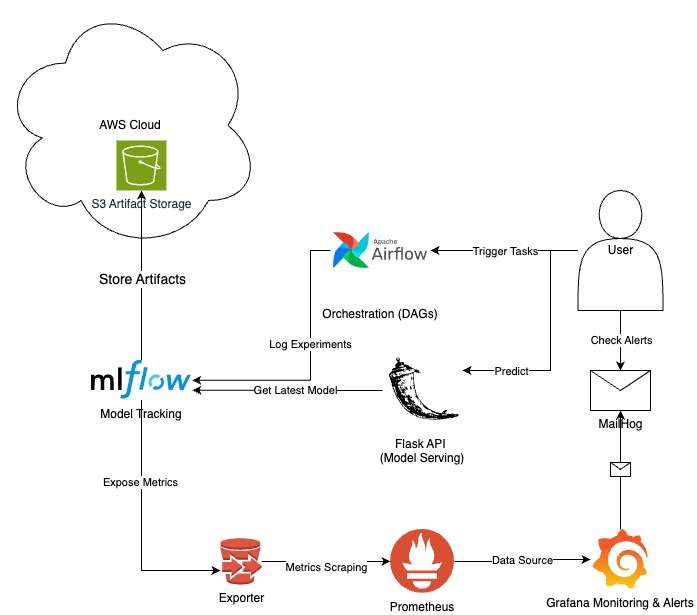

# Machine Learning Model Lifecycle Management System

This repository contains a comprehensive implementation of a Machine Learning Model Lifecycle Management System. It demonstrates the complete lifecycle of a machine learning model, including training, versioning, scheduling, monitoring, alerting, and serving predictions via an API.

## Table of Contents

- [Introduction](#introduction)
- [Architecture Overview](#architecture-overview)
  - [Component Interaction Flow](#component-interaction-flow)
- [Project Structure](#project-structure)
- [Environment Setup](#environment-setup)
  - [Prerequisites](#prerequisites)
  - [AWS Credentials](#aws-credentials)
- [Running the Project](#running-the-project)
- [Detailed Explanation of Components](#detailed-explanation-of-components)
  - [AWS Setup](#aws-setup)
    - [S3 Bucket Configuration](#s3-bucket-configuration)
    - [IAM Users and Roles](#iam-users-and-roles)
    - [AWS Secrets Manager](#aws-secrets-manager)
    - [Reasoning Behind Choices](#reasoning-behind-choices)
  - [MLflow Integration](#mlflow-integration)
    - [Configuring MLflow with S3](#configuring-mlflow-with-s3)
    - [Reasoning Behind Choices](#reasoning-behind-choices-1)
  - [Airflow Setup](#airflow-setup)
    - [DAGs and Tasks](#dags-and-tasks)
    - [Reasoning Behind Choices](#reasoning-behind-choices-2)
  - [Monitoring and Alerting](#monitoring-and-alerting)
    - [Prometheus Configuration](#prometheus-configuration)
    - [Grafana Dashboard and Alerts](#grafana-dashboard-and-alerts)
    - [Reasoning Behind Choices](#reasoning-behind-choices-3)
  - [Model Serving via API](#model-serving-via-api)
    - [Flask API Implementation](#flask-api-implementation)
    - [Model Update Mechanism](#model-update-mechanism)
    - [Reasoning Behind Choices](#reasoning-behind-choices-4)
- [Testing and Edge Cases](#testing-and-edge-cases)
- [Conclusion](#conclusion)
- [Contact Information](#contact-information)
- [Additional Notes for Reviewers](#additional-notes-for-reviewers)

---

## Introduction

This project showcases an end-to-end Machine Learning Model Lifecycle Management System, focusing on the following key aspects:

1. **Model Training and Versioning**: Automate model training and store models with unique versions, hyperparameters, and accuracy metrics.
2. **Scheduled Training**: Use Apache Airflow to schedule daily training with retries and service-level agreements (SLAs).
3. **Monitoring**: Visualize model accuracy over time and compute the average accuracy over the last week using Prometheus and Grafana.
4. **Alerting**: Set up alerts for scenarios such as the latest model being older than 36 hours or the model accuracy dropping below a certain threshold.
5. **Model Serving**: Provide an API endpoint to serve predictions using the latest available model, which automatically updates when a new version is available.

---

## Architecture Overview

The system integrates several components to achieve complete lifecycle management:

- **AWS S3**: Stores MLflow artifacts, including model versions and metrics.
- **MLflow**: Manages experiment tracking, model versioning, and artifact storage.
- **Apache Airflow**: Orchestrates scheduled training tasks with retries and SLAs.
- **Prometheus**: Collects and stores metrics for monitoring model performance.
- **Grafana**: Visualizes metrics and sets up alerting rules.
- **Flask API**: Serves the latest model for predictions via a RESTful interface.
- **Docker and Docker Compose**: Containerizes and orchestrates all services for consistent deployment.



### Component Interaction Flow

1. **Model Training**:
   - Airflow triggers the model training DAG daily.
   - The training script logs metrics and parameters to MLflow.
   - Trained models and artifacts are stored in the S3 bucket via MLflow.

2. **Model Monitoring**:
   - Prometheus scrapes metrics from the MLflow exporter.
   - Grafana visualizes these metrics and calculates averages over time.
   - Alerts are configured in Grafana to monitor specific conditions.

3. **Model Serving**:
   - The Flask API loads the latest model from MLflow.
   - Clients can request predictions via the API endpoint.
   - The API automatically updates the model if a new version is available.

---

## Project Structure

```
.
├── README.md
├── docker-compose.yml
├── setup_aws_env.sh
├── requirements.txt
├── postgres-init.sql
├── mlflow/
│   └── Dockerfile
├── orchestration/
│   ├── dags/
│   │   ├── __init__.py
│   │   └── daily_model_training.py
│   └── python_scripts/
│       ├── __init__.py
│       ├── data_generation.py
│       ├── data_preprocessing.py
│       ├── model_training.py
│       └── model_evaluation.py
├── monitoring/
│   ├── prometheus/
│   │   └── prometheus.yml
│   ├── grafana/
│   │   ├── provisioning/
│   │   │   ├── datasources/
│   │   │   │   └── datasources.yaml
│   │   │   ├── dashboards/
│   │   │   │   └── dashboards.yaml
│   │   │   └── alerting/
│   │   │       └── alerting.yaml
│   │   └── dashboards/
│   │       └── ml_model_metrics.json
│   └── exporter/
│       ├── Dockerfile
│       └── exporter.py
├── serving/
│   ├── app.py
│   ├── requirements.txt
│   └── Dockerfile
└── data/
    └── (Data files generated during runtime)
```

---

**Notes For Reviewers**:
I didn't always follow best practices in my project due to time constraints and simplicity. I will attempt to explain my decisions in certain areas and what would have been preferable in ideal circumstances. 

## Environment Setup

### Prerequisites

- **Operating System**: Linux-based OS is recommended.
- **Docker**: Ensure Docker is installed and running (My Macbook M2 was running Docker-Desktop).
- **Docker Compose**: Version compatible with Docker.
- **AWS Credentials**: Access to AWS services (For this project, S3) with necessary permissions.

### AWS Credentials

To run this project, you will need AWS credentials with the necessary permissions to access S3 and other AWS services used in this project.

**For Reviewers**:

- The aws_credentials.zip file contains the AWS configurations and credentials. This file requires a password to access. The password is the surname of the HR officer I spoke with, written in lower case letters.
- Please contact the project author at [imamogluubilal@gmail.com](mailto:imamogluubilal@gmail.com) to directly obtain the necessary credentials.
- **Important**: Handle these credentials securely and do not expose them publicly.

---

## Running the Project

1. **Clone the Repository**:

   ```sh
   git clone https://github.com/bilalimamoglu/ml-lifecycle-system.git
   cd ml-lifecycle-system
   ```

2. **Set Up AWS Credentials**:

   - Copy the provided AWS credentials (`credentials` and `config` files) into the project's `.aws` directory:

     ```sh
     mkdir -p .aws
     cp path_to_provided_credentials .aws/credentials
     cp path_to_provided_config .aws/config
     ```

     Replace `path_to_provided_credentials` and `path_to_provided_config` with the actual paths to the files.

   - Alternatively, run the provided script to set up AWS environment variables:
   
     ```sh
     aws configure
     ```

     ```sh
     ./setup_aws_env.sh
     ```

     This script copies your AWS credentials from `~/.aws/credentials` and `~/.aws/config` to the project's `.aws` directory and sets the environment variables `AWS_SHARED_CREDENTIALS_FILE` and `AWS_CONFIG_FILE`.

3. **Initialize PostgreSQL Databases**:

   - The `postgres-init.sql` script will automatically create the necessary databases and users when the PostgreSQL container starts.

4. **Build and Start Services**:

   - Use Docker Compose to build and run all services:

     ```sh
     docker-compose up -d --build
     ```

5. **Access the Web Interfaces**:

   - **Airflow**: [http://localhost:8080](http://localhost:8080) (Username: `airflow`, Password: `airflow`)
   - **MLflow**: [http://localhost:5000](http://localhost:5000)
   - **Grafana**: [http://localhost:3000](http://localhost:3000) (Username: `admin`, Password: `admin`)
   - **MailHog**: [http://localhost:8025](http://localhost:8025)
   - **Model API**: [http://localhost:5001](http://localhost:5001)

6. **Trigger the Airflow DAG**:

   - In the Airflow UI, manually trigger the `daily_model_training` DAG to start the initial training process.

7. **Verify Model Training**:

   - Check the MLflow UI to verify that a new run has been logged.
   - Ensure that model artifacts are stored in the S3 bucket.

8. **Test the Model API**:

   - Send a POST request to the `/predict` endpoint:

     ```sh
     curl -X POST -H "Content-Type: application/json" \
     -d '{"sepal length (cm)": 5.1, "sepal width (cm)": 3.5, "petal length (cm)": 1.4, "petal width (cm)": 0.2}' \
     http://localhost:5001/predict
     ```

   - Expected Response:

     ```json
     {
       "prediction": ["setosa"]
     }
     ```

9. **Monitor Metrics and Alerts**:

   - In Grafana, view the **ML Model Metrics Dashboard**.
   - Check for any alerts in the **Alerting** section.
   - Use MailHog to view any email notifications triggered by alerts.

---

## Detailed Explanation of Components

### AWS Setup

#### S3 Bucket Configuration

- **Bucket Name**: `mlflow-artifacts-bilalimg`
- **Purpose**: Stores MLflow artifacts such as models, metrics, and parameters.
- **Configuration**:
  - The bucket is configured to allow access only from authorized IAM users and services.
  - Access policies are set to ensure that only specified IAM roles and users can access the bucket.

#### IAM Users and Roles

- **IAM Users**:
  - `cli-user`: Used for AWS CLI interactions, such as uploading artifacts to S3.
  - `reviewer-user`: Provides access for reviewers to inspect the project.

- **IAM Group**:
  - **Name**: `ml-lifecycle`
  - **Purpose**: Manages permissions for users involved in the ML lifecycle project.
  - **Policy Attached**: `ml-lifecycle-policy`

- **IAM Policy (`ml-lifecycle-policy`)**:
  - **Permissions**:
    - `S3`: Access to the specified S3 bucket for reading and writing artifacts.

#### Reasoning Behind IAM Choices

- **AWS S3**: Provides scalable, secure, and durable storage for artifacts. It integrates seamlessly with MLflow for artifact storage.
- **IAM Users and Roles**: Using IAM users and groups with appropriate policies ensures secure and organized access management, adhering to the principle of least privilege.

#### Reasoning Behind MLFlow Choice

- **MLflow**: Provides a robust framework for tracking experiments, versioning models, and storing artifacts.
- **Integration with S3**: Allows for scalable and durable storage of models and artifacts.
- **PostgreSQL Backend**: Serves as a reliable backend for MLflow's tracking data.
- **Simplicity** To make it less complicated overall, I merely used MLFlow Experiment Tracking in this instance.

### Airflow Setup

#### DAGs and Tasks

- **DAG File**: `orchestration/dags/daily_model_training.py`
- **Tasks**:

  1. **generate_data**:
     - Generates the Iris dataset and saves it to `data/iris.csv`.
     - **Why**: Guarantees that each training cycle (in the real world) uses new data.

  2. **preprocess_data**:
     - Splits data into training and testing sets.

  3. **train_model**:
     - Trains a Random Forest model with random hyperparameters.
     - Logs parameters and metrics to MLflow.

  4. **evaluate_model**:
     - Evaluates the trained model on the test set.
     - Logs accuracy to MLflow.

- **Retries and SLAs**:
  - Configured in `default_args` of the DAG.
  - Retries set to `1` with a delay of `5` minutes.

#### Reasoning Behind Airflow Choices

- **Apache Airflow**: Provides a powerful platform for orchestrating complex workflows with scheduling, retries, and SLA management.
- **PythonOperator**: Allows for flexibility in defining tasks using Python functions.
- The orchestration folder contains DAGS. This is a bad habit in the actual world. Because you have to pause the entire Airflow system for a while in order to deploy each time you alter the DAGS.
- Additionally, to keep things separate, modular and more professional, I would prefer DockerOperator or KubernetesPodOperator over PythonOperator if I had more time.

### Monitoring and Alerting

#### Prometheus Configuration

- **Configuration File**: `monitoring/prometheus/prometheus.yml`

- **Exporter**:

  - Custom exporter located in `monitoring/exporter/`.
  - Exposes MLflow metrics such as `model_accuracy` and `training_accuracy_score`.
  - **Dockerfile**:

#### Grafana Dashboard and Alerts

- **Provisioning**:

  - Dashboards, datasources, and alerting rules are provisioned using configuration files in `monitoring/grafana/provisioning/`.

- **Datasources**:

  - Configured in `datasources.yaml` to point to the Prometheus instance.

- **Dashboard**:

  - JSON file `ml_model_metrics.json` defines panels for:

    - **Model Accuracy Over Time**: Displays `model_accuracy` metric.
    - **Training Accuracy Score**: Shows `training_accuracy_score`.

- **Alerts**:

  - Configured in `alerting.yaml`.
  - **Alert Conditions**:

    - **Low Model Accuracy**:
      - Triggers if `model_accuracy` falls below `0.99`.
      - Evaluated over the last `5` minutes.

    - **Model Staleness**:
      - Triggers if the model hasn't been updated in the last `36` hours.
      - Uses `model_last_updated` metric from the exporter.

- **Notifications**:

  - Alerts are sent via email using **MailHog**, a local SMTP server for testing.

#### Reasoning Behind Monitoring Choices

- **Prometheus**: Ideal for collecting and storing time-series data, enabling real-time monitoring.
- **Grafana**: Provides a user-friendly interface for visualizing metrics and setting up complex alerting rules.
- **MailHog**: Enables email notification testing without actually sending emails. I used it for the first time and found it to be useful for testing.
- I would have like to use AWS SNS if I had more time, but time was not a resource I had.

### Model Serving via API

#### Flask API Implementation

- **Location**: `serving/app.py`
- **Functionality**:

  - Provides a `/predict` endpoint that accepts input features in JSON format.
  - Returns predictions based on the latest model.

#### Model Update Mechanism

- **Model Update Daemon**:

  - A background thread checks for new model versions every `60` seconds.
  - Loads the latest model from MLflow if a new version is available.

- **Why Not Use Model Registry**:

  - Chose simplicity over setting up MLflow Model Registry.
  - Directly querying the latest run ensures the most recent model is used without additional configuration.
  - In the real world settings, different models would produce different results over varying periods of time. For instance, I would choose the model that performed the best during the previous month.

#### Reasoning Behind Flask Choices

- **Flask**: Lightweight and easy to set up for building a RESTful API.

---

## Testing and Edge Cases

To ensure that the system works as expected, please perform the following test cases:

1. **Model Training Verification**:

   - **Objective**: Verify that the model is trained successfully and all parameters and metrics are logged to MLflow.
   - **Steps**:
     - Trigger the Airflow DAG.
     - Check MLflow UI for a new run.
     - Verify that the model artifacts are stored in the specified S3 bucket.

2. **Scheduled Training**:

   - **Objective**: Confirm that the Airflow DAG runs daily as scheduled and handles retries.
   - **Steps**:
     - Check the Airflow scheduler to ensure the DAG is scheduled correctly.
     - Simulate a failure (e.g., by temporarily disabling network connectivity) and observe if the DAG retries.

3. **Model Serving**:

   - **Objective**: Test the prediction endpoint with valid and invalid input data.
   - **Steps**:
     - Send valid data to the `/predict` endpoint and verify the response.
     - Send invalid data (e.g., missing fields) and confirm that appropriate error messages are returned.

4. **Monitoring Metrics**:

   - **Objective**: Verify that Prometheus is scraping metrics and Grafana is displaying them correctly.
   - **Steps**:
     - Access the Prometheus UI and check the metrics.
     - View the Grafana dashboard and confirm that metrics are displayed.

5. **Alerting Mechanisms**:

   - **Objective**: Ensure that alerts are triggered under specified conditions.
   - **Steps**:
     - Modify the `evaluate_model.py` to produce a low-accuracy model and trigger an alert.
     - Stop the Airflow scheduler and wait for 36 hours (or adjust the alert threshold for testing) to trigger a staleness alert.
     - Check MailHog to verify that alert emails are received.

6. **Data Integrity**:

   - **Objective**: Ensure data preprocessing is functioning correctly.
   - **Steps**:
     - Verify that the data is correctly split into training and testing sets.
     - Check that the data files exist and contain expected values.

**Note**: Testing edge cases ensures that the system is robust and can handle unexpected scenarios gracefully.

---

## Contact Information

For any questions or further assistance, please contact:

- **Name**: Bilal Imamoglu
- **Email**: [imamogluubilal@gmail.com](mailto:imamogluubilal@gmail.com)
- **GitHub**: [github.com/bilalimamoglu](https://github.com/bilalimamoglu)

---

## Additional Notes for Reviewers

- **AWS Resources**:

  - All necessary AWS resources, including IAM users, policies, and S3 bucket, have already been set up.
  - You do not need to create or modify any AWS configurations. Just use reviewer cli.

- **Credentials**:

  - Please handle the provided AWS credentials securely and ensure they are not exposed in any public forums or repositories.
  - Contact the author to obtain the necessary credentials.

- **Testing Environment**:

  - The project is designed to run in a local development environment using Docker.
  - No deployment to AWS services beyond S3 is required.

- **Data Privacy**:

  - The project uses the Iris dataset, which is publicly available and does not contain sensitive information.

- **Feedback**:

  - Your feedback is valuable. Please feel free to provide any comments or suggestions regarding the implementation.

---

Thank you for taking the time to review this project!